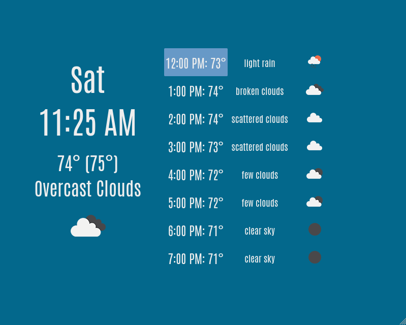

# weatherdash-go

_Go rewrite of <https://github.com/mjkelly/weatherdash>. This version is more
maintained (to the extent that I maintain either)._

This is the server side portion of a weather dashboard for your house, using
data and icons from <https://openweathermap.org/>.

The idea is that you put a portable computer (like a Raspberry Pi, or similar)
somewhere running Chrome and load this web page. This dashboard can be running
on your portable computer, or somewhere else.

It's designed to look good on an 800x640 screen. Here's a screenshot:

Here's a photo of a much older version of weatherdash running on a this
screen from Adafruit: <https://www.adafruit.com/product/2260>

## Installation

This requires a working [Go](https://golang.org) installation, and GNU Make.

Copy `config.json.example` to `config.json` to start. You only _need_ to update
keys that have a value of `FILL_ME_IN` in `config.json.example`.

_If you just want to see a demo at this point, you can run `make run` and visit
http://localhost:5000/fake -- that will read fake weather data stored locally.
You must have a config.json file, but you need not change it at all._

### Step 1: Config Setup

1. **API Key:** You need to get your own API key for <https://openweathermap.org/>. Put your
   API key in the `api_key` field of `config.json`.
2. **Location:** You have should pick location to get weather for! The default is New York
   City. You can use <https://www.latlong.net/> for this. The config expects
   numerical (positive and negative numbers, no north/south or east/west), like
   this website provides. Put these in the `lat` and `lon` fields of
   `config.json`.

### Step 2: Run it

Run `make` in this directory to build and run the server. It'll listen on port
8080. Go to `<your-ip-address>:8080` to have a look. If you're building this on
your local machine, that's `http://localhost:8080`

## Debugging

If you're debugging the layout, add `?reload=false` to the URL to skip the
periodic reload. That will avoid wiping refreshing the HTML periodically.
